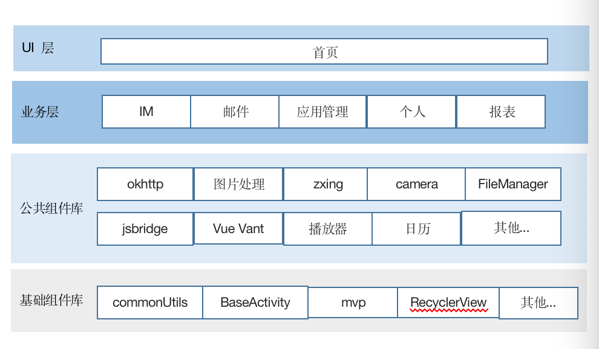

本项目是基于ARouter实现的一个组件化框架，仅供参考；网上很多ARouter的例子，这里不再赘述；这里分享一下个人在分层设计上的看法。

我目前就职于一个还行的大公司（^_^），维护着一个内部沟通的App以及新业务的开发，包含公司所有的业务功能模块几十个；由于总部在二线城市，人员流动大，项目原先采用MVC模式，就一个项目包含所有Android原生代码，质量可想而知；我们设计了分层设计框架，进行渐进式重构改造，个人主要负责主体架构的设计和分层实施；

项目选择了ARouter实现，H5 部分使用 JsBridge 封装了一个基础组件；

进行改造之前，主要进行一下规范上面的设定，整个团队达成共识：
1. 遵循设计原则，特别是单一职责原则必须遵守；
2. 最少代码原则，一个方法不要超过50行，一个类尽量不要超过300行；
3. 命名就是最好的注释，代码就是最好的文档；

另外，我们也总结了一条大家都认可都编程规范，融于我们的代码审核流程中；

分层设计的思路：



组件封装：
建议自己搭建maven库，类似libWebView组件进行单独封装，上传到私有maven，（例子中有注释的maven操作实例，仅供参考）

简单介绍一下WebView的使用：
## webview与js交互详细分析

## 1. 基本使用介绍

 ```
  <!-- 方式一：使用腾讯X5内核 -->
  <com.xin.lib.dbridge.DWebView
        android:id="@+id/js_call_native_webview"
        android:layout_width="match_parent"
        android:layout_height="match_parent" />  

 ```

## 2. JsBridge 使用介绍

   2.1 Js 调用 Android 使用方式
        Android端注册：
```
    mWebView.addJavascriptObject(new JsEchoApi(), "MyNamespace");

    public class JsEchoApi {

    @JavascriptInterface
    public Object syn(Object args) throws JSONException {
        JSONObject jsonObject = new JSONObject(args.toString());
        return  jsonObject.get("msg");
    }

    @JavascriptInterface
    public void asyn(Object args, CompletionHandler handler){
        handler.complete(args);
    }
}
```
js 调用
```
    // 同步操作
    dsBridge.call("MyNamespace.syn", {msg: "js 同步调用 Android 测试！", tag: 1})

    // 异步操作
    dsBridge.call("MyNamespace.asyn", {msg: "js 异步调用 Android 测试", tag: 2}, function (ret) {
         alert(JSON.stringify(ret));
    })
```

2.2 Android 调用原生

    js 端注册
```
    //注册 javascript API 
 dsBridge.register('addValue',function(l,r){
     return l+r;
 })
```
Android native断调用：
```
webView.callHandler("addValue",new Object[]{3,4},new OnReturnValue<Integer>(){
     @Override
     public void onValue(Integer retValue) {
        Log.d("jsbridge","call succeed,return value is "+retValue);
     }
});
```

## 3. 原理讲解

   3.1 js调用Android 的方式采用 addJavascriptInterface 对象映射的方式：

    mWebView.addJavascriptObject(new JsEchoApi(), "MyNamespace");
    
    ** 相当于 JsEchoApi jsEchoApi = new JsEchoApi();
              jsEchoApi.syn();  
       面向对象的方式；
    
    同步无需 js 返回结果，这种方式最简单！

3.2 需要 js 异步返回时：
    js调用返回结果之后，Android使用 evaluateJavascript("javascript:**", ValueCallback<T>()) 获取返回数据；
    ** "javascript:**" 是自定义的调用js的方式。


腾讯X5内核的参考文档：https://x5.tencent.com/tbs/guide/sdkInit.html

X5WebView  腾讯X5内核，国外不能使用
DWebView   DBridge 方式的默认WebView；


## 使用参数约定规范：

###1. 为了兼容IOS，我们约定 Java API 签名如下：

####同步API.
    public any handler(Object msg)
        *** 参数必须是 Object 类型，但 返回值类型 没有限制，可以是任意类型。

####异步 API.
    public void handler(Object arg, CompletionHandler handler)

##原生规范：
基础功能 命名空间 为空，
    mWebView.addJavascriptObject(new DefaultJsInterface(this), null);
    
业务功能 使用 业务名称 为命名空间; 如订单系统 Order, 命名空间使用 "order"
    mWebView.addJavascriptObject(new OrderJsInterface(this), "order");
    
##H5 规范

基于Vue 微前端架构正在搭建中。。。


